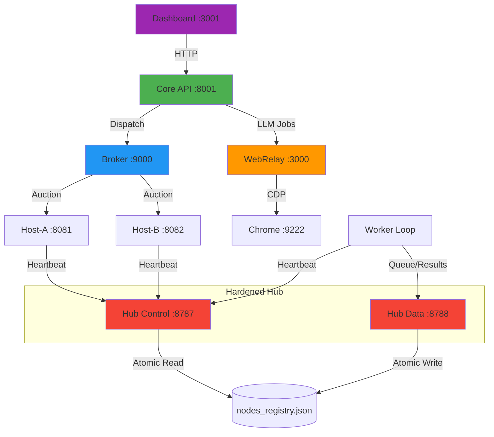

# Sheratan System Overview & Port Guide

## Quick Answer: IDE Integration

**Ja, du kannst das System über die IDE steuern!** Die IDE kann:
- ✅ Terminals öffnen und Commands ausführen (wie gerade mit [START_COMPLETE_SYSTEM.bat](file:///c:/sauber_main/START_COMPLETE_SYSTEM.bat))
- ✅ HTTP-Requests an alle Services senden
- ✅ Logs in Echtzeit anzeigen
- ✅ Browser-Automation für UI-Tests durchführen

---

## Complete Port Map

### Hub Services (Hardened Mesh)

| Port | Service | Purpose | Health Check |
|------|---------|---------|--------------|
| **8787** | **Hub Control** | Heartbeats, Registry, Bundle Access | `GET /health` (Public) |
| **8788** | **Hub Data** | Job Queues, Results, Admin Path | `GET /health` (Localhost) |

---

## Service Architecture



---

## Hardening Runbook

### 1. Environment Variables (Required)
| Variable | Default | Purpose |
|----------|---------|---------|
| `SHERATAN_HUB_TOKEN` | `shared-secret` | Mandatory secret for mesh communication. |
| `SHERATAN_HUB_TOKEN_REQUIRED` | `1` | Enforces 403 on missing/invalid tokens. |
| `SHERATAN_NODE_TTL_SEC` | `120` | Seconds until a node is marked **STALE**. |
| `SHERATAN_NODE_DEAD_SEC` | `600` | Seconds until a node is marked **DEAD**. |

### 2. Operational Checks (Smoke Suite)
Run the automated checklist to verify port isolation and security:
```powershell
.\smoke_checks.ps1
```

### 3. Failure Modes & Recovery
- **"AUTH_FAIL" in worker logs**: Double-check `SHERATAN_HUB_TOKEN` matches on both Hub and Worker.
- **"PORT_MISMATCH" in audit log**: A client is trying to pull jobs from 8787 or send heartbeats to 8788. Verify client configuration.
- **Node is STALE**: Verify if CPU is pegged or network latency is high. Heartbeat interval should be ~10-15s.
- **Registry Corruption**: The system uses `write_atomic`. If `nodes_registry.json` is lost, it will self-repopulate as nodes send their next heartbeats.

### 4. Security Audit & Monitoring
- **Audit Logs**: `C:\gemmaloop\.sheratan\logs\hub_security_audit.jsonl`
- **Alert Logs**: `C:\gemmaloop\.sheratan\logs\alerts.jsonl` (Tracks bursts of failed auth/routing).
- **Watcher**: Run `python -m hub.audit_watcher` in background for real-time alerting.

---

## Observability V2 (Detailed)

### 1. Hub Metrics (/metrics)
Both Hub ports provide real-time telemetry:
- **Control (8787)**: Node health counts (`ONLINE`, `STALE`, `DEAD`) and security event rates.
- **Data (8788)**: Queue depth and results pending processing.

### 2. Diagnostics
To collect a full troubleshooting bundle, run:
```powershell
.\scripts\diagnose.ps1
```
This generates a `diag_bundle_<timestamp>.zip` containing logs, metrics, registry snapshot, and sanitized metadata.

---

## Data-Plane Robustness V2

### 1. Backpressure (B1)
The Data-Plane (8788) now implements active load shedding:
- **Queue Limit**: Controlled by `SHERATAN_MAX_QUEUE_DEPTH` (Default: 1000). Exceeding this returns `429 Too Many Requests`.
- **Inflight Limit**: Controlled by `SHERATAN_MAX_INFLIGHT` (Default: 100). When saturated, workers receive a `defer_ms` signal to slow down.
- **Lease Reaper**: Stale jobs (pulled but not acked within `SHERATAN_LEASE_TIMEOUT`, default 300s) are automatically returned to the queue.

### 2. Failure Modes (Added)
- **`BACKPRESSURE_DROP`**: Inbound request rejected due to full queue.
- **`INFLIGHT_SATURATED`**: Hub is at concurrent job capacity; signaling workers to wait.
- **`LEASE_REAP`**: Abandoned job detected and requeued for delivery.

### 3. Idempotency (B2)
The Data-Plane now supports at-most-once processing via `idempotency_key`:
- **Rules**: Same key + Same payload returns existing `job_id` and status (`accepted`, `in_progress`, `completed`).
- **Collisions**: Same key + Different payload returns `409 Conflict`.
- **Caching**: Completed jobs return a cached minimal result to avoid expensive re-computation or re-delivery.
- **Verification**: SHA256/HMAC integrity verification on result submission (Track B3).
- **Failures**: `IDEMPOTENCY_KEY_COLLISION` and `RESULT_INTEGRITY_FAIL` events logged to audit trail.

## Control-Plane Governance (Track A)

### Token Rotation (A1)
- **Dual-Token Acceptance**: The Hub can simultaneously accept an `ACTIVE_TOKEN` and a `NEXT_TOKEN` during a defined rotation window.
- **Automatic Promotion**: Once the `SHERATAN_HUB_TOKEN_ROTATION_UNTIL` deadline passes, the `NEXT_TOKEN` becomes the only valid secret, effectively retiring the old token without requiring a Hub restart.
- **Audit Events**: `TOKEN_ACCEPTED_NEXT`, `TOKEN_RETIRED`, and `TOKEN_ROTATION_FINALIZED` track the rotation lifecycle.
- **Metrics**: Tracked via `auth_failure.old_token_1m` and `auth_failure.invalid_1m`.

### Node Attestation (A2)
- **Mechanik**: Erfassung von `build_id`, `capability_hash` und `runtime` via Heartbeat.
- **Drift-Erkennung**: Vergleich der aktuellen Signale mit dem `first_seen` Record. Bei Abweichung Status `DRIFT` und Health `YELLOW`.
- **Spoofing-Verdacht**: Überwachung schneller Änderungen des Capability-Hashes (Flip-Flop). Schwellenwert: ≥3 Änderungen (konfigurierbar via `SHERATAN_ATTESTATION_SPOOF_THRESHOLD`).
- **Audit Events**: `ATTESTATION_FIRST_SEEN`, `ATTESTATION_DRIFT`, `ATTESTATION_SPOOF_SUSPECT`.
- **Signal-only**: Attestation-Status beeinflusst die Health (YELLOW), blockiert aber keine funktionalen Requests.
