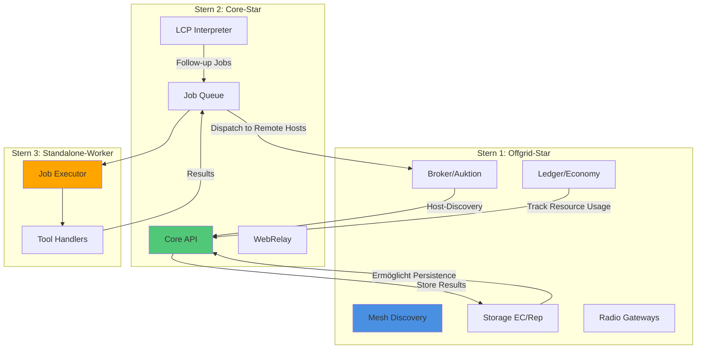

# 🌟 Sheratan Drei-Sterne-System: Analyse & Integration

Ich habe beide "Sterne" aus dem `2_sheratan_core` Repository analysiert. Hier ist, was ich gefunden habe:

---

## 🎯 Die Drei Sterne im Überblick

### ⭐ Stern 1: **Offgrid-Star** (Offgrid-Net v0.16.4)
**Rolle:** Dezentrales Mesh-Netzwerk & Off-Grid Infrastruktur

**Kernfunktionen:**
- **P2P-Mesh Discovery** (UDP, LoRa, BLE, BT-LR)
- **Host-Daemon** mit REST-APIs (Port 8081+)
- **Broker** (Mikro-Auktionen für Compute/Storage)
- **Storage** (Erasure Coding 12/20, Replication, E2EE)
- **Ledger** (DAG, Merkle-Receipts, Quorum-TX)
- **Economy** (Wallets, TXs, Auto-Settlement, Rewards)
- **Radio-Gateways** (Multi-Transport: UDP/LoRa/BLE)

**Technologie:**
- Pure Python (stdlib-only für Core)
- Optional: `PyNaCl` (Ed25519, X25519, XChaCha20-Poly1305)
- Optional: `pyserial` (LoRa), `bleak` (BLE)

**Zweck:**
> Schafft die **Netzwerk- und Wirtschaftsschicht** für autonome Agents, die in **Off-Grid-Szenarien** arbeiten müssen.

---

### ⭐ Stern 2: **Core-Star** (Sheratan Core v2)
**Rolle:** Autonomer Agent-Orchestrator mit LCP (Language Control Protocol)

**Kernfunktionen:**
- **Mission/Task/Job** Hierarchie (FastAPI)
- **LCP Interpreter** (LLM-gesteuerte Follow-up Jobs)
- **Worker System** (File-Queue basiert)
- **WebRelay Bridge** (Browser-Automation via Puppeteer)
- **Tool Handlers** (`list_files`, `read_file`, `write_file`, `llm_call`, `agent_plan`)
- **Metrics & Dashboard** (WebSocket, Vue/Vite)

**Technologie:**
- Python (FastAPI, Pydantic)
- Node.js (WebRelay, Puppeteer)
- Docker Compose (4 Services)
- File-based Queue (`relay-out`, `relay-in`)

**Zweck:**
> Schafft die **autonome Intelligenzschicht** – ein Agent, der sich selbst neue Tasks erstellt und ausführt.

---

### ⭐ Stern 3: **Standalone-Worker** (noch zu klonen)
**Rolle:** Separater Worker-Prozess (TypeScript/Node.js oder Python)

**Vermutete Funktionen** (basierend auf Kontext):
- Eigenständiger Worker, der **unabhängig** von Core laufen kann
- Könnte **spezielle Tools** oder **Plattform-Zugriffe** haben (z.B. Desktop-Automation, Vision)
- Wahrscheinlich kompatibel mit Core's Job-Queue

---

## 🔗 Wie die Sterne zusammenarbeiten (könnten)

---

## 🤔 Mögliche Integrationsszenarien

### 🎯 Szenario 1: **Verteilte Autonome Agents**
**Konzept:** Core-Star dispatcht Jobs an **mehrere Hosts** im Offgrid-Mesh

**Flow:**
1. **Core** erstellt Mission (z.B. "Analysiere Codebase")
2. Core erstellt Tasks → Jobs (z.B. "Read file X", "LLM analyze Y")
3. **Broker** (Offgrid) führt Auktion → findet günstigsten Host
4. Job wird auf **Remote Standalone-Worker** dispatcht (über Offgrid-Mesh)
5. Worker führt aus → Result über **Storage** zurück
6. **LCP** interpretiert → erstellt Follow-up Jobs
7. **Ledger** trackt Kosten → Settlement via Tokens

**Vorteil:**
- Agent kann **verteilt** arbeiten (multi-node)
- Kosten werden **fair abgerechnet** (Ledger)
- **Off-Grid-fähig** (LoRa, BLE, UDP)

---

### 🎯 Szenario 2: **Dezentrales LLM-Netzwerk**
**Konzept:** Jeder Host im Mesh bietet LLM-Kapazität an

**Flow:**
1. Host-A startet `host_daemon` (Offgrid) + registriert **Compute-Preis**
2. Core-Star benötigt `llm_call` → fragt **Broker** nach Quote
3. Broker findet günstigsten Host → dispatcht Job
4. Host-A führt LLM-Call aus → Receipt + Result
5. **Auto-Settlement** verteilt Rewards → Wallet-Update

**Vorteil:**
- LLM-Calls werden **load-balanced** über Mesh
- Wirtschaftliche **Incentivierung** für Host-Betreiber
- Resilient gegen **Ausfälle** (Failover im Broker)

---

### 🎯 Szenario 3: **Persistent Agent Memory**
**Konzept:** Agent-State wird in Offgrid-Storage repliziert

**Flow:**
1. Core-Star führt Mission aus → erstellt **Results**
2. Results werden via **EC 12/20** in Offgrid-Storage gespeichert
3. **Replication r=5** über mehrere Hosts
4. Agent kann später **Resume** → lädt State aus Storage
5. **Quorum-basiert** → nur finalisierte States gelten

**Vorteil:**
- Agent-State ist **persistent** und **fehlertolerant**
- Kann auf **jedem Host** wiederhergestellt werden
- Off-Grid-Szenarien abgedeckt

---

## 🚀 Konkrete Integrationspunkte

### 📍 Integration Point 1: **Job Dispatch → Broker**
**Änderung in Core:**
- `sheratan_core_v2/webrelay_bridge.py::enqueue_job()`
- Statt lokale File-Queue → **HTTP POST** an Offgrid-Broker
- Broker führt Auktion → dispatcht an besten Host

**Änderung in Offgrid:**
- `broker/broker_stub.py` akzeptiert **Core-Jobs**
- Host-Daemon führt `worker_loop.py`-ähnliche Logic aus

---

### 📍 Integration Point 2: **Storage Backend**
**Änderung in Core:**
- `sheratan_core_v2/storage.py` nutzt **Offgrid-Storage API**
- Statt lokale `data/`-Ordner → `POST /store` an Offgrid-Hosts
- Job-Results werden **E2EE + EC** gespeichert

**Änderung in Offgrid:**
- Host-Daemon erweitert `/store` um **Job-Result-Schema**

---

### 📍 Integration Point 3: **Ledger für LCP-Kosten**
**Konzept:** Jeder LCP-Follow-up-Job trackt **Kosten**

**Änderung in Core:**
- `lcp_actions.py::handle_job_result()` → erstellt **TX** für Job-Kosten
- TX wird an Offgrid-Ledger gesendet
- Auto-Settlement rechnet ab

**Änderung in Offgrid:**
- `economy/txlog.py` importiert Core-Job-Metriken

---

## 📊 Vergleich: Offgrid vs. Core

| Aspekt | Offgrid-Star | Core-Star |
|--------|--------------|-----------|
| **Fokus** | Netzwerk & Wirtschaft | Intelligenz & Orchestrierung |
| **Architektur** | Dezentral, P2P | Zentral (Backend + Worker) |
| **Kommunikation** | UDP/LoRa/BLE/HTTP | File-Queue, HTTP |
| **Persistenz** | EC/Replication (resilient) | File-Storage (lokal) |
| **Wirtschaft** | Wallets, TXs, Quorum | Keine (nur Metriken) |
| **Autonomie** | Broker (Auktionen) | LCP (LLM-Follow-ups) |
| **Off-Grid** | ✅ Voll unterstützt | ❌ IP-basiert |

---

## 💡 Empfehlung: Integration-Roadmap

### Phase 1: **Proof of Concept** (1-2 Tage)
1. ✅ Repositories geklont (erledigt)
2. **Core + Offgrid lokal starten**
   - Core via `docker-compose up`
   - Offgrid via `pilot-starter-REAL.bat` (2-3 Nodes)
3. **Manueller Bridge-Test**
   - Core-Job manuell an Offgrid-Broker senden
   - Result zurückholen
   - *Ziel:* Beweisen, dass Interop funktioniert

---

### Phase 2: **Bridge-Implementierung** (3-5 Tage)
1. **WebRelay-Bridge erweitern**
   - Neue Klasse `OffgridBridge` in `core/`
   - Erkennt Offgrid-Hosts via Discovery
   - Dispatcht Jobs via Broker-API
2. **Storage-Adapter**
   - `OffgridStorage` Klasse
   - Nutzt `/store` und `/fetch` von Host-Daemon
3. **Tests**
   - Mission mit 1 Remote-Job
   - Result-Retrieval
   - LCP Followup-Kette

---

### Phase 3: **Economy Integration** (5-7 Tage)
1. **Cost-Tracking**
   - Jeder Job loggt `compute_tokens_m`, `latency_ms`
   - Core → TX an Ledger
2. **Auto-Settlement**
   - `auto_settle_daemon.py` läuft parallel zu Core
   - Rechnet Jobs ab
3. **Dashboards**
   - Integriere Offgrid-Metriken in Core-Dashboard
   - Zeige Wallet-Balances, Reputation

---

### Phase 4: **Off-Grid Resilience** (7-10 Tage)
1. **Radio-Gateway-Integration**
   - Core kann Jobs via **LoRa** senden (kleinere Payloads)
2. **Failover**
   - Quorum-Failover für stalled Jobs
   - Reassign an andere Hosts
3. **Multi-Site**
   - Core läuft auf Laptop
   - Workers auf Desktop + Raspberry Pi

---

## 🎬 Nächste Schritte

### Was ich vorschlage:
1. **Standalone-Worker klonen** (für vollständiges Bild)
2. **Pilot-Test:** Beide Sterne lokal starten
   - Core: `cd c:\Projects\2_sheratan_core && docker-compose up`
   - Offgrid: `cd c:\Projects\2_sheratan_core\offgrid-net-v0.16.4-with-memory-PRO-UI-POLICY-ROTATE && pilot-starter-REAL.bat`
3. **Analyse der Logs** → Verstehen, wie sie standalone laufen
4. **Entscheidung:** Welchen Integration-Punkt willst du **zuerst** testen?

---

## 🔍 Meine Einschätzung

> **Offgrid-Star** und **Core-Star** sind **perfekt komplementär**:
> - Offgrid bringt die **Resilienz, Wirtschaft, und Off-Grid-Fähigkeit**
> - Core bringt die **Intelligenz, LCP-Autonomie, und Tool-Execution**
> 
> **Integration ist sinnvoll**, wenn dein Ziel ist:
> - ✅ Autonome Agents, die **verteilt** arbeiten
> - ✅ Wirtschaftliche **Incentivierung** von Compute/Storage
> - ✅ **Off-Grid-Szenarien** (LoRa, BLE)
> 
> **Aber:** Integration ist **nicht trivial** – beide Systeme haben unterschiedliche Paradigmen (file-queue vs. HTTP, zentralisiert vs. P2P).
>
> **Mein Vorschlag:** Starte mit **Phase 1** (PoC), um zu sehen, wie sie zusammenspielen. Dann entscheiden wir, ob vollständige Integration lohnt.

---

**Erstellt:** 2026-01-03  
**Autor:** Antigravity (Corallen)  
**Kontext:** Analyse von `2_sheratan_core` Repository
