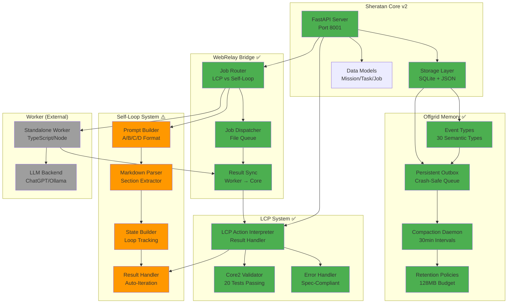

# Sheratan Core - System Architecture

## 🎯 Current System Overview



## 📊 Component Status

### ✅ **Complete & Functional**
| Component | Location | Status |
|-----------|----------|--------|
| Core API | `main.py` | Running on :8001 |
| Storage Layer | `storage.py` | SQLite + JSON |
| Event Types | `event_types.py` | 30 types defined |
| Persistent Outbox | `outbox.py` | Crash-safe queue |
| Compaction | `main.py` L112-130 | 30min daemon |
| Retention | `main.py` L105-110 | 128MB budget |
| LCP Actions | `lcp_actions.py` | Result interpreter |
| Core2 Validator | `lcp/core2/validator.py` | 20 tests ✅ |
| Error Handler | `lcp_actions.py` L94-103 | Spec-compliant |
| WebRelay Bridge | `webrelay_bridge.py` | Job routing |

### ⚠️ **Partial (60-90%)**
| Component | Location | Missing |
|-----------|----------|---------|
| Self-Loop Prompt | `selfloop_prompt_builder.py` | Worker integration |
| Markdown Parser | `selfloop_utils.py` | Worker output format |
| State Builder | `selfloop_utils.py` | End-to-end test |
| Result Handler | `lcp_actions.py` L345-410 | API endpoints |

### ❌ **Not Integrated**
- Dashboard APIs (`/api/selfloop/*`)
- Worker Self-Loop support
- End-to-end Self-Loop test

---

## 🔧 Technical Priorities

### **Priority 1: Self-Loop Worker Integration** (Critical)
**Problem:** Worker doesn't understand Self-Loop format

**Solution:**
1. Worker muss `response_format: "selfloop_markdown"` erkennen
2. Worker muss A/B/C/D Markdown zurückgeben
3. Test mit Mock-Worker

**Effort:** 30-45 min

### **Priority 2: API Endpoints** (Medium)
**Problem:** Endpoints in `selfloop_api_endpoints.py` nicht in `main.py`

**Solution:**
```python
# In main.py, add:
from .selfloop_api_endpoints import *
```

**Effort:** 5 min

### **Priority 3: End-to-End Test** (High)
**Problem:** Kein vollständiger Test

**Solution:**
1. Create test mission
2. Dispatch Self-Loop job
3. Verify iteration loop

**Effort:** 30 min

---

## 📁 File Structure

```
2_sheratan_core/
├── core/
│   ├── sheratan_core_v2/
│   │   ├── main.py                    ✅ Core API
│   │   ├── storage.py                 ✅ Storage
│   │   ├── models.py                  ✅ Data Models
│   │   ├── event_types.py             ✅ Event Types
│   │   ├── outbox.py                  ✅ Persistent Outbox
│   │   ├── storage_adapter.py         ✅ Offgrid Adapter
│   │   ├── lcp_actions.py             ✅ LCP Interpreter
│   │   ├── webrelay_bridge.py         ✅ Job Router
│   │   ├── selfloop_utils.py          ⚠️ Markdown Parser
│   │   ├── selfloop_prompt_builder.py ⚠️ Prompt Builder
│   │   └── selfloop_api_endpoints.py  ❌ Not merged
│   └── lcp/
│       ├── core2/
│       │   ├── validator.py           ✅ Validator
│       │   └── schema_core2.json      ✅ Schema
│       └── selfloop/
│           └── lcp_validator.py       ✅ Self-Loop Validator
├── docs/                              ✅ Organized
├── dashboards/                        ✅ Organized
├── tests/                             ✅ Organized
└── archive/                           ✅ Cleanup done
```

---

## 🎯 Recommendation

**Focus on Technical Core:**
1. ✅ Skip Dashboard (expensive, not critical)
2. 🎯 Fix Worker Integration (critical path)
3. 🎯 Merge API Endpoints (5 min)
4. 🎯 End-to-End Test (validation)

**After that:** System is production-ready!

**Dashboard:** Can be added later as separate phase.
